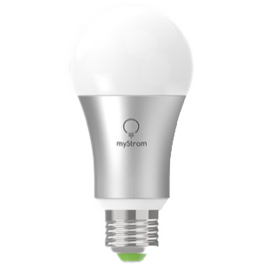

# ioBroker.mystrom-wifi-bulb

[](https://www.npmjs.com/package/iobroker.mystrom-wifi-bulb)

## What it is

This is an adaptor to connect [MyStrom Wifi Bulbs](https://mystrom.ch/de/wifi-bulb/) with the [ioBroker](https://www.iobroker.net) home automation system. These are light bulbs with an integrated webserver and a [REST-API](http://api.mystrom.ch) to program colors, brightness, and turn on and off.
 
## Hardware installation

When first switched on, the bulb goes in WPS mode for 3 minutes. If you aktvate your router's WPS within this time span, the bulb will appear in the router's client list.

## Software Installation

### Prerequisites

- A working instance of [ioBroker](http://www.iobroker.net). If you only want a quick test-install, I recommend using [docker](https://www.docker.com/):  
`docker run -p 8081:8081 -p 8087:8087 -p 8082:8082 -p 9004:9004 --name iobroker -v iobrokerdata:/opt/iobroker buanet/iobroker:latest` (note that you need an otherwise unused port for this mystrom-wifi-bulb adapter, here arbitrarly 9004)

- The MyStrom-Wifi-Bulb should already be active and integrated in the Network. If you have more than one bulb, you need an instance of the adapter for each of them.

### Fetch and install ioBroker.mystrom-wifi-button

This adapter is not part of the official ioBroker distribution. So it will not show up in ioBroker admin's adapter list. You can install it either directly from NPM:

[](https://nodei.co/npm/iobroker.mystrom-wifi-bulb/)

or as a custom adapter from the admin-ui:


Make sure to select "Beliebig" even though it's situated on Github:


Find out the release you're interessed in: <https://github.com/rgwch/ioBroker.mystrom-wifi-bulb/releases> and copy/paste the address of the .tar.gz link.

Read the warning and click "install" if you agree.

The adapter should then be in the admin pages's list:


Click on the three dots near the right upper corner and then on the **+** sign in the lower left corner to create a new instance. You need a separate instance for each MyStrom Wifi Bulb in your Home.

The configuration dialog should open after successful creation of the instance. 


Insert the IP Address of the bulb on the left side. Since the bulb need a callback to notify about changes, the IP Address of the ioBroker instance with this adapter must be inserted on the right. The port number is at will, only it must not be used by another service. Here we chose 9004. (If the docker instance runs inside docker, make sure that the port is propagated to the outside, as in the example above)

After clicking save and close, the instance should appear and turn "green".

## Use


## mystrom-wifi-bulb adapter for ioBroker

Control Mystrom lights

## Developer manual
This section is intended for the developer. It can be deleted later

### Getting started

You are almost done, only a few steps left:
1. Create a new repository on GitHub with the name `ioBroker.mystrom-wifi-bulb`
1. Initialize the current folder as a new git repository:  
    ```bash
    git init
    git add .
    git commit -m "Initial commit"
    ```
1. Link your local repository with the one on GitHub:  
    ```bash
    git remote add origin https://github.com/rgwch/ioBroker.mystrom-wifi-bulb
    ```

1. Push all files to the GitHub repo:  
    ```bash
    git push origin master
    ```
1. Head over to [src/main.ts](src/main.ts) and start programming!

### Best Practices
We've collected some [best practices](https://github.com/ioBroker/ioBroker.repositories#development-and-coding-best-practices) regarding ioBroker development and coding in general. If you're new to ioBroker or Node.js, you should
check them out. If you're already experienced, you should also take a look at them - you might learn something new :)

### Scripts in `package.json`
Several npm scripts are predefined for your convenience. You can run them using `npm run <scriptname>`
| Script name | Description                                              |
|-------------|----------------------------------------------------------|
| `build`    | Re-compile the TypeScript sources.                       |
| `watch`     | Re-compile the TypeScript sources and watch for changes. |
| `test:ts`   | Executes the tests you defined in `*.test.ts` files.     |
| `test:package`    | Ensures your `package.json` and `io-package.json` are valid. |
| `test:unit`       | Tests the adapter startup with unit tests (fast, but might require module mocks to work). |
| `test:integration`| Tests the adapter startup with an actual instance of ioBroker. |
| `test` | Performs a minimal test run on package files and your tests. |
| `lint` | Runs `ESLint` to check your code for formatting errors and potential bugs. |

### Writing tests
When done right, testing code is invaluable, because it gives you the 
confidence to change your code while knowing exactly if and when 
something breaks. A good read on the topic of test-driven development 
is https://hackernoon.com/introduction-to-test-driven-development-tdd-61a13bc92d92. 
Although writing tests before the code might seem strange at first, but it has very 
clear upsides.

The template provides you with basic tests for the adapter startup and package files.
It is recommended that you add your own tests into the mix.

### Publishing the adapter
To get your adapter released in ioBroker, please refer to the documentation 
of [ioBroker.repositories](https://github.com/ioBroker/ioBroker.repositories#requirements-for-adapter-to-get-added-to-the-latest-repository).

### Test the adapter manually on a local ioBroker installation
In order to install the adapter locally without publishing, the following steps are recommended:
1. Create a tarball from your dev directory:  
    ```bash
    npm pack
    ```
1. Upload the resulting file to your ioBroker host
1. Install it locally (The paths are different on Windows):
    ```bash
    cd /opt/iobroker
    npm i /path/to/tarball.tgz
    ```

For later updates, the above procedure is not necessary. Just do the following:
1. Overwrite the changed files in the adapter directory (`/opt/iobroker/node_modules/iobroker.mystrom-wifi-bulb`)
1. Execute `iobroker upload mystrom-wifi-bulb` on the ioBroker host

## Changelog

### 0.0.1
* (rgwch) initial release

## License
MIT License

Copyright (c) 2020 rgwch <rgw@rgw.ch>

Permission is hereby granted, free of charge, to any person obtaining a copy
of this software and associated documentation files (the "Software"), to deal
in the Software without restriction, including without limitation the rights
to use, copy, modify, merge, publish, distribute, sublicense, and/or sell
copies of the Software, and to permit persons to whom the Software is
furnished to do so, subject to the following conditions:

The above copyright notice and this permission notice shall be included in all
copies or substantial portions of the Software.

THE SOFTWARE IS PROVIDED "AS IS", WITHOUT WARRANTY OF ANY KIND, EXPRESS OR
IMPLIED, INCLUDING BUT NOT LIMITED TO THE WARRANTIES OF MERCHANTABILITY,
FITNESS FOR A PARTICULAR PURPOSE AND NONINFRINGEMENT. IN NO EVENT SHALL THE
AUTHORS OR COPYRIGHT HOLDERS BE LIABLE FOR ANY CLAIM, DAMAGES OR OTHER
LIABILITY, WHETHER IN AN ACTION OF CONTRACT, TORT OR OTHERWISE, ARISING FROM,
OUT OF OR IN CONNECTION WITH THE SOFTWARE OR THE USE OR OTHER DEALINGS IN THE
SOFTWARE.