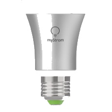
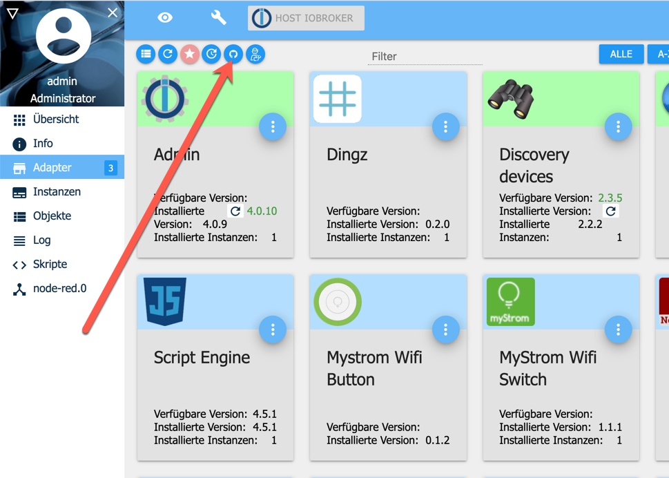
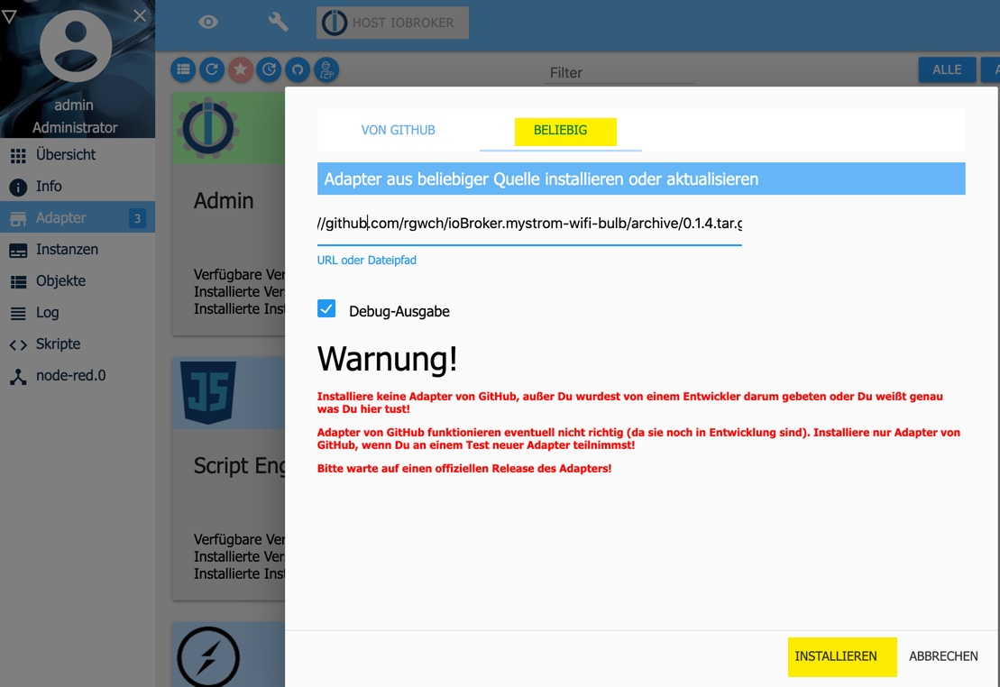
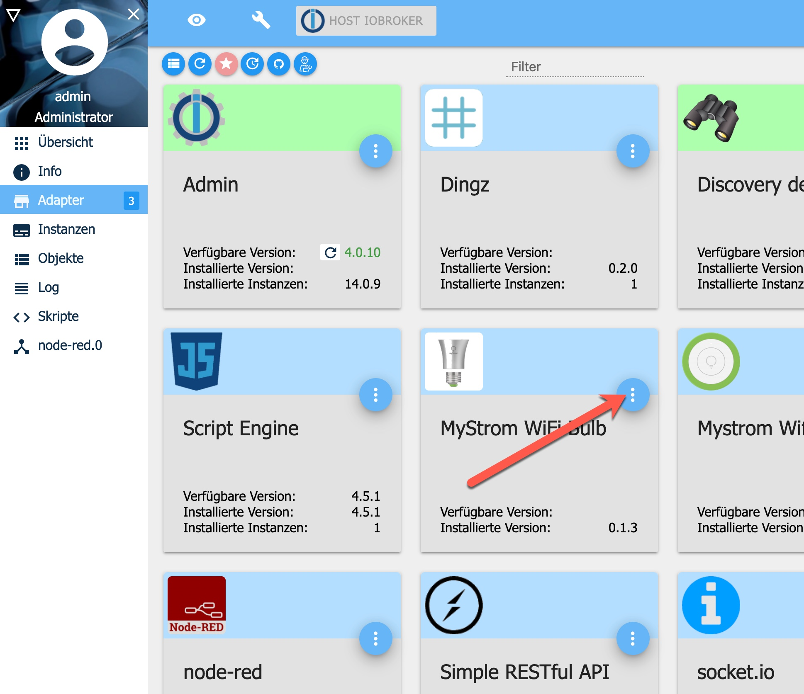
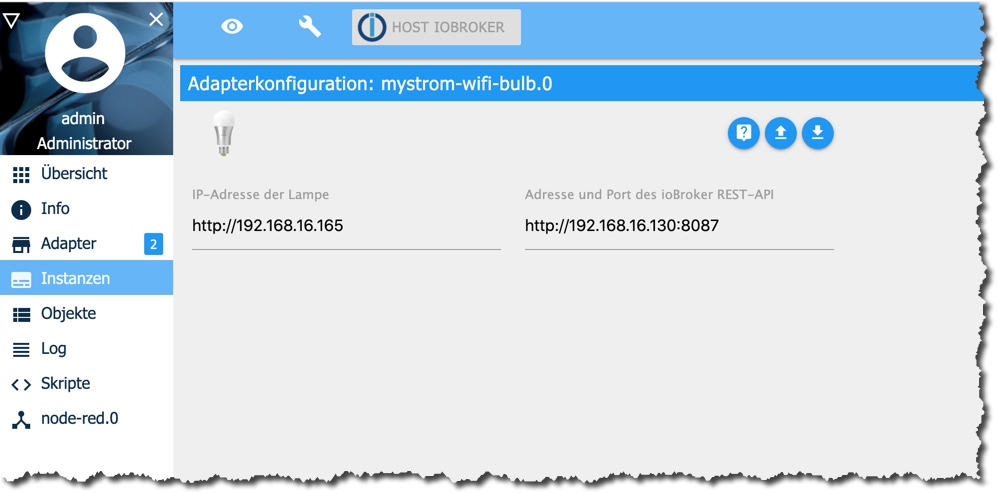

[](https://www.npmjs.com/package/iobroker.mystrom-wifi-bulb)
[](https://travis-ci.com/rgwch/ioBroker.mystrom-wifi-bulb)

# ioBroker.mystrom-wifi-bulb


## What it is

This is an adaptor to connect [MyStrom Wifi Bulbs](https://mystrom.ch/de/wifi-bulb/) with the [ioBroker](https://www.iobroker.net) home automation system. These are light bulbs with an integrated webserver and a [REST-API](http://api.mystrom.ch) to program colors, brightness, and turn on and off.
 
## Hardware installation

When first switched on, the bulb goes in WPS mode for 3 minutes. If you activate your router's WPS within this time span, the bulb will appear in the router's client list. Consult the bulb's documentation for more informations.

## Software Installation

### Prerequisites

- A working instance of [ioBroker](http://www.iobroker.net). If you only want a quick test-install, I recommend using [docker](https://www.docker.com/):  
`docker run -p 8081:8081 -p 8087:8087 -p 8082:8082 -p 9004:9004 --name iobroker -v iobrokerdata:/opt/iobroker buanet/iobroker:latest` (note that you need an otherwise unused port for this mystrom-wifi-bulb adapter, here arbitrarly 9004)

- The MyStrom-Wifi-Bulb should already be active and integrated in the Network. 

### Fetch and install ioBroker.mystrom-wifi-button

This adapter is not part of the official ioBroker distribution. So it will not show up in ioBroker admin's adapter list. You can install it either directly from NPM:

[](https://nodei.co/npm/iobroker.mystrom-wifi-bulb/)

or as a custom adapter from the admin-ui:



Make sure to select "Beliebig" even though it's situated on Github:



Find out the release you're interested in: <https://github.com/rgwch/ioBroker.mystrom-wifi-bulb/releases> and copy/paste the address of the .tar.gz link.

Read the warning and click "install" if you agree.

The adapter should then be in the admin pages's list:



Click on the three dots near the right upper corner and then on the **+** sign in the lower left corner to create a new instance. You need a separate instance for each MyStrom Wifi Bulb in your Home.

The configuration dialog should open after successful creation of the instance. 



Insert the IP Address of the bulb on the left side. Since the bulb need a callback to notify about changes, the IP Address of the ioBroker instance with this adapter must be inserted on the right. The port number is at will, only it must not be used by another service. Here we chose 9004. (If the ioBroker instance runs inside docker, make sure that the port is propagated to the outside, as in the example above)

After clicking save and close, the instance should appear and turn "green".

## Use

The MyStrom-Wifi-Bulb adapter No. X (starting with 0) will create the following ioBroker states:

* mystrom-wifi-bulb.X.on  (read/write: switch on/off)
* mystrom-wifi-bulb.X.ramp (read/write: duration of switching in ms)
* mystrom-wifi.bulb.X.mode (read only: rgb, hsv or mono)
* mystrom-wifi.bulb.X.color (read only: color values, depending of mode)
* mystron-wifi-bulb.X.power (read only: Power consumption of the bulb in Watt)

Note: This version of the adapter is not able to switch colors and color modes programmatically. Any hints on how to do that are welcome :-)

Use the states in ioBroker scripting or VIS UI Design

Example:

````javascript
const bulb1="mystrom-wifi-bulb.0.on"
const pir="hm-rcp-pir.0.activated"

// Light on for 2 Minutes if infrared sensor is activated
on({id: pir},()=>{
  setState(bulb1,true)
  setTimeout(()=>{
    setState(bulb1,false)
  },120000)
})
````

## Changelog

### 0.0.1
* (rgwch) initial release

## License
MIT License

Copyright (c) 2020 rgwch <rgw@rgw.ch>

Permission is hereby granted, free of charge, to any person obtaining a copy
of this software and associated documentation files (the "Software"), to deal
in the Software without restriction, including without limitation the rights
to use, copy, modify, merge, publish, distribute, sublicense, and/or sell
copies of the Software, and to permit persons to whom the Software is
furnished to do so, subject to the following conditions:

The above copyright notice and this permission notice shall be included in all
copies or substantial portions of the Software.

THE SOFTWARE IS PROVIDED "AS IS", WITHOUT WARRANTY OF ANY KIND, EXPRESS OR
IMPLIED, INCLUDING BUT NOT LIMITED TO THE WARRANTIES OF MERCHANTABILITY,
FITNESS FOR A PARTICULAR PURPOSE AND NONINFRINGEMENT. IN NO EVENT SHALL THE
AUTHORS OR COPYRIGHT HOLDERS BE LIABLE FOR ANY CLAIM, DAMAGES OR OTHER
LIABILITY, WHETHER IN AN ACTION OF CONTRACT, TORT OR OTHERWISE, ARISING FROM,
OUT OF OR IN CONNECTION WITH THE SOFTWARE OR THE USE OR OTHER DEALINGS IN THE
SOFTWARE.

## More like this

* ['MyStrom WiFi Switch' Adapter](http://github.com/rgwch/ioBroker.mystrom-wifi-switch)
* ['Dingz' Adapter](http://github.com/rgwch/ioBroker.dingz)
* ['MyStrom WiFi Button' Adapter](http://github.com/rgwch/ioBroker.mystrom-wifi-button)